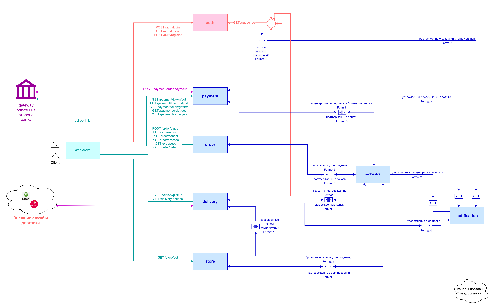

### 1. Пользовательские сценарии

#### Регистрация нового клиента

Есть новый клиент  
И есть интернет-магазин  
И клиент переходит по ссылке "Зарегестрироваться"  
Тогда загружается страница с формой регистрации нового клиента,  
содержащая поля для заполнения:  
1) имя клиента  
2) пароль (маскированное)  
3) e-mail  
4) номер телефона;   

и неактивную кнопку "зарегистрировать"   

Когда клиент заполняет форму  
Тогда кнопка "зарегистрировать" становится активной  
Когда клиент нажимает кнопку "зарегестрировать"   
Тогда клиент получает страницу с результатом регистрации  

#### Создание заказа

Есть авторизованный клиент  
И есть интернет-магазин  
И клиент еще не выбрал ни одного товара  
И клиент вводит в строке поиска "Требуемый товар"  
Тогда появляется список товаров, подходящих под  
запрос клиента  
И в карточке товара пользователь видит  
 1) название  
 2) цену  
 3) изображение  
 4) доступность в разных магазинах
  
Когда клиент нажимает на карточку товара  
Тогда клиент переходит на страничку с описанием  
товара и кнопкой "Добавить в корзину"  
Когда клиент нажимает "Добавить в корзину"  
Тогда создается новый заказ с одним товаром.  

#### Добавление товара в заказ

Есть авторизованный клиент  
И есть интернет-магазин  
И клиент уже выбрал хотя бы один товар   
И клиент вводит в строке поиска "Требуемый товар"  
Тогда появляется список товаров, подходящих под  
запрос клиента  
И в карточке товара пользователь видит  
 1) название  
 2) цену  
 3) изображение  
 4) доступность в разных магазинах  

Когда клиент нажимает на карточку товара  
Тогда клиент переходит на страничку с описанием  
товара и кнопкой "Добавить в корзину"  
Когда клиент нажимает "Добавить в корзину"  
Тогда товар добавляется к заказу.  
 

#### Удаление товара из заказа

Есть авторизованный клиент  
И есть интернет-магазин  
И клиент уже выбрал хотя бы один товар   
Когда клиент нажимает ссылку "Моя корзина"  
Тогда ему отображается форма, содержащая:  
 1) список товарных позиций в заказе. Каждая позиция содежит:  
   1.1) описание товара  
   1.2) цена товара  
   1.3) количество товара в заказе  
   1.4) общая стоимость товарной позиции  
   1.5) опцию "удалить товар из корзины"  
 2) общую стоимость заказа  
 3) кнопку "Оформить заказ"   

Когда клиент выбирает опцию "удалить товар из корзины" для одной из товарных позиций  
Тогда появляется окно подтверждения  
Когда клиент подтверждает удаление  
Тогда отображается корзина заказа без удаленного товара   

#### Оформление заказа / доставка на пункт выдачи

Есть авторизованный клиент   
И есть интернет-магазин  
И клиент уже выбрал хотя бы один товар   
Когда клиент нажимает ссылку "Моя корзина"  
Тогда ему отображается форма, содержащая:  
 1) список товарных позиций в заказе. Каждая позиция содежит:  
   1.1) описание товара  
   1.2) цена товара  
   1.3) количество товара в заказе  
   1.4) общая стоимость товарной позиции  
   1.5) опцию "удалить товар из корзины"  
 2) общую стоимость заказа  
 3) кнопку "Оформить заказ"  

Когда клиент нажимает кнопку "Оформить заказ"  
Тогда открывается форма с выбором способа доставки, содержащая опции:  
 1) доставка курьером  
 2) забрать товар на пункте выдачи  
Когда клиент выбирает опцию "Забрать товар на пункте выдачи"  
Тогда активируется раздел, позволяющий выбрать пункт выдачи из списка   
Когда клиент выбирает требуемый пункт выдачи из списка  
Тогда активируется кнопка "Оплатить заказ"  

#### Оформление заказа / доставка на дом

Есть авторизованный клиент   
И есть интернет-магазин  
И клиент уже выбрал хотя бы один товар   
Когда клиент нажимает ссылку "Моя корзина"  
Тогда ему отображается форма, содержащая:  
 1) список товарных позиций в заказе. Каждая позиция содежит:  
   1.1) описание товара  
   1.2) цена товара  
   1.3) количество товара в заказе  
   1.4) общая стоимость товарной позиции  
   1.5) опцию "удалить товар из корзины"  
 2) общую стоимость заказа  
 3) кнопку "Оформить заказ"  

Когда клиент нажимает кнопку "Оформить заказ"  
Тогда открывается форма с выбором способа доставки, содержащая опции:  
 1) доставка курьером  
 2) забрать товар на пункте выдачи  

Когда клиент выбирает опцию "Доставка курьером"  
Тогда активируется раздел с формой, позволяющей:  
 1) ввести адрес доставки  
 2) выбрать курьерскую компанию   

Когда клиент вводит адрес доставки  
И клиент выбирает курьерскую компанию  
Тогда визуализируется стоимость доставки и чек-бокс "подтвердить стоимость доставки"  
Когда клиент отмечает чек-бокс "подтвердить стоимость доставки"  
Тогда активируется кнопка "Оплатить заказ".  

#### Оплата заказа банковской картой или через систему быстрых платежей

Есть авторизованный клиент  
И есть интернет-магазин  
И клиент находится в конце сценария "Оформление заказа / доставка на пункт выдачи" или "Оформление заказа / доставка на дом"   
Когда клиент нажимает нажимает кнопку "Оплатить заказ"  
Тогда появляется форма "Выбор способа оплаты" с опциями:  
  1) банковской картой   
    1.1) со списком привязанных карт клиента   
    1.2) опцией "другая карта"  
  2) через систему быстрых платежей  
  3) из кошелька клиента с информацией о балансе кошелька  

Когда клиент выбирает опцию оплаты "банковской картой" (новой или привязанной) или "через систему быстрых платежей"  
Тогда клиент переходит на страницу оплаты банковского API
Тогда начинается сценарий "Оплата заказа банковской картой" или "Оплата через СБП" (* здесь их не расписываем, поскольку они определяются банковским API)  
Когда сценарий "Оплата заказа банковской картой" успешно пройден  
Тогда клиент возвращается на страницу заказа
И на странице заказа отображается результат оплаты заказа  

#### Оплата заказа из кошелька клиента

Есть авторизованный клиент  
И есть интернет-магазин  
И клиент находится в конце сценария "Оформление заказа / доставка на пункт выдачи" или "Оформление заказа / доставка на дом"   
Когда клиент нажимает нажимает кнопку "Оплатить заказ"  
Тогда появляется форма "Выбор способа оплаты" с опциями:  
  1) банковской картой   
    1.1) со списком привязанных карт клиента   
    1.2) опцией "другая карта"  
  2) через систему быстрых платежей  
  3) из кошелька клиента с информацией о балансе кошелька  

Когда и если клиент выбирает опцию оплаты "из кошелька клиента"  
И баланс кошелька достаточен для оплаты заказа  
Тогда активируется кнопка "Оплатить"  
Когда клиент нажимает кнопку "Оплатить"  
Тогда отображается результат оплаты заказа  
И на почту клиента отправляется письмо, содержащее результат оплаты  

#### Пополнение кошелька

Есть авторизованный клиент  
И есть интернет-магазин  
И клиент переходит по ссылке "Личный кабинет"  
Тогда отображается окно, содержащее  
   1) учетные данные клиента  
   2) баланс его кошелька   
   3) поле ввода для суммы пополнения  
   3) кнопку "Пополнить баланс кошелька"   
Когда клиент заполняет поле "сумма пополнения"  
И клиент нажимает на кнопку "Пополнить баланс кошелька"  
Тогда начинается выполнение сценария "Оплата заказа"  
Когда сценарий "Оплата заказа" успешно пройден  
Тогда на форме отображается:  
   1) обновленный баланс кошелька  
   2) ссылка-приглашение перейти к каталогу товаров  

### 2. Общая схема взаимодействия сервисов.

### 3. Назначение сервисов и их зона ответственности.

#### auth (аутентификация и авторизация)

- хранит пользовательские данные: clientId, пароль, имя пользователя, средства коммуникации (телефон, e-mail)  
- регистрирует нового клиента;  
- создает задание на регистрацию и открытие нового кошелька в payment и учетной записи сервиса уведомлений (notification)  
- аутентифицирует клиента через технологию "единого входа";  
- авторизует сессию клиента по запросу от других сервисов, передает им необходимые атрибуты клиента.  

#### delivery (CRM доставки)

- ведет учет точек выдачи заказа  
- взаимодействует с внешними delivery компаниями (получает оценку стоимости, формирует внешний заказ на доставку)  
- после прихода запроса от orchestra создает кейс доставки (до пункта выдачи или до дома);  
- управляет кейсом доставки;  
- уведомляет клиента о доставке товара в пункт выдачи (или о предстоящей доставке на адрес).  

#### notification (сервис доставки уведомлений клиентам)

- заводит новые клиентские учетные записи с привязкой к ним каналов доставки (почта, SMS, push);  
- отправляет через зарегистрированные каналы уведомления о совершенных платежах или попытках совершения платежа;  
- отправляет через зарегистрированные каналы уведомления о подтвеждении заказа;  
- отправляет через зарегистрированные каналы уведомления о доставке товара на пункт назначения / предстоящей доставке на дом.  

#### orchestra (оркестратор согласования заказа)

- согласует готовые (укомплектованные, оплаченные и одобренные пользователем) заказы:  
  - подтверждает факт и сумму платежа в payment;  
  - подтверждает наличие товара в store и создает кейс на комплетование заказа в store;  
  - создает кейс на доставку заказа в delivery;  
- отправляет информацию об итоге обработки в сервис нотификации.  

#### order (сервис управления заказом)

- по запросу пользователя создает и комплектует заказ;  
- по запросу пользователя отменяет заказ;  
- формирует заказ на покупку подарочной карты;  
- передает заказ в обработку orchestra;   
- получает и сохраняет финальный статус заказа от orchestra.  

#### payment (сервис совершения платежей)

- управляет сохраненными (привязанными) средствами платежа клиента (банковские карты, кошелек);  
- хранит балансы клиентских кошельков;  
- по запросу от клиента формирует списание с банковского счета клиента (через bank-api) для:  
  -- оплаты заказа;  
  -- пополнения кошелька клиента;  
- по запросу от клиента формирует списание c кошелька;  
- по запросу от orchestra выполняет отмену совершенного платежа (в рамках отката распределенной транзакции);  
- формирует запросы на уведомление о платежах/попытках платежей для notification;  
- заводит новые клиентские кошельки при регистрации клиента;  

#### store (сервис учета товаров на складе)

- ведет учет товаров на складах;  
- после прихода запроса от orchestra бронирует товар и создает кейс на комплектацию заказа;  
- управляет кейсом комплектации заказа.   

#### web-front (пользовательcкое приложение)

реализует все пользовательские сценарии, взаимодействует:  
- auth, клиент:   
         -- регистрируется как новый клиент;   
         -- аутентификацию и авторизацию клиента в системе;  
         -- корректирует данные в личном кабинете;  

- delivery, клиент:   
         -- получает данные о пунктах выдачи, вариантах доставки и сроках доставки;  

- order, клиент:  
        -- создает новый заказ;   
        -- изменяет заказ;   
        -- подтверждает (или отменяет) заказ;  
        -- просматривает текущий статус заказа;  

- payment: клиент выбирает средство платежа, создает новое средство платежа;   
           выполняет оплату или пополнение через выбранное средство платежа;  
           по переданной payment платежной ссылке оcуществляет сценарий оплаты через банковское API;  

- store: клиент:  
        -- получает актуальные сведения о наличии товара на складе.  

### 4. Контракты взаимодействия сервисов друг с другом.

Содержатся в каталоге contracts/  
